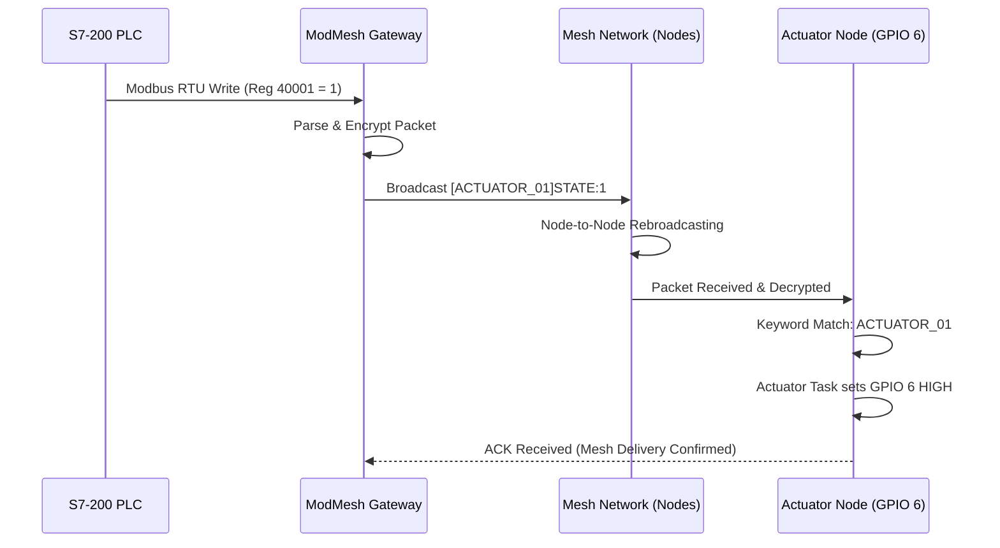

# ⚡ ESP-NOW MeshCore - Actuator Node (ESP32-S3)

* **File Path:** `README.md`
* **Author:** M. YOUCEF Yazid (yazid.youcef@gmail.com)
* **Version:** 0.9.5 (Industrial Edition)
* **Update Date:** 2026-05-11

---

## 📖 Overview
The **ModMesh Actuator Node** is a high-performance, industrial-grade output controller designed for the ESP-NOW MeshCore ecosystem. It is optimized for high-reliability hardware control, featuring a decoupled real-time architecture that ensures wireless networking never interferes with physical switching operations.

Designed for industrial automation, this node listens for encrypted commands across the mesh and triggers physical outputs (relays, LEDs, solenoids) based on a smart **Pub/Sub Keyword Routing** system.

---

## 🌐 Network Ecosystem & Integration

The Actuator Node is a core component of the broader **ModMesh Industrial Framework**. It primarily interacts with the **ModMesh Gateway** to bridge wireless mesh actions with wired industrial controllers (PLCs).

### 1. Gateway & PLC Integration (S7-200)
The Gateway acts as a **Modbus RTU Slave**. When a PLC (like the Siemens S7-200) writes to a virtual register on the Gateway, that event is automatically translated into a wireless mesh broadcast targeting this Actuator.

| Modbus Register | Target Keyword | Action |
| :--- | :--- | :--- |
| **40001** | `ACTUATOR_01` | Primary Output (GPIO 6) Control |
| **40002** | `ALL` / `LIGHTS` | Group Broadcast / Emergency Kill |

### 2. PLC-to-Actuator Sequence Diagram


### 3. Multi-Source Control
While the Gateway is the primary controller, the Actuator is **Source-Agnostic** and can be triggered by:
*   **Sensor Nodes:** A wireless button press on a "Sensor Node" can trigger the actuator without Gateway intervention (Direct Peer-to-Peer).
*   **Emergency Interlocks:** A network-wide `CMD:NETWORK_RESET` originating from any authorized node will force a safe state.

---

## 🧠 Deep Dive: How the Actuator Works

The actuator operates using a **Quad-Task RTOS Model**, separating time-critical hardware control from complex network management.

### 1. The Quad-Task RTOS Architecture
| Task Name | Priority | Stack Size | Function |
| :--- | :--- | :--- | :--- |
| **Sensor Task** | 10 (Highest) | 4KB | Polls local inputs (buttons/switches) every 50ms. |
| **Actuator Task** | 7 (High) | 4KB | Processes the command queue and toggles GPIO 6. |
| **Mesh Task** | 5 (Medium) | 4KB | Background radio management, heartbeats, & health checks. |
| **Reset/Persist** | 1 (Idle-ish) | 8KB | Monitors Reset Button (GPIO 1) & NVS cleanup. |

### 2. Smart Pub/Sub Filtering
The node employs a sophisticated filtering logic in `process_command()`:
*   **Keyword Extraction:** Parses metadata inside brackets, e.g., `[LIGHT,ACTUATOR_01]`.
*   **Targeting Logic:** Executed **ONLY IF** matching `ALL`, `NODE_LABEL`, or `ACTUATOR_KEYWORDS`.

---

## 🔌 Hardware Configuration

| Function | Pin (GPIO) | Description |
| :--- | :--- | :--- |
| **Main Output** | `GPIO 6` | Primary control for Relay/LED (Active High) |
| **Reset Button** | `GPIO 1` | 3rd-Party Reset (Pull-up configurable) |
| **Status LED** | `GPIO 48` | On-board WS2812B RGB Diagnostic LED |

---

## 🚥 Visual Diagnostic Legend

*   🔴 **SOLID RED:** Factory State (No peers registered).
*   🟢 **SOLID GREEN:** Network Healthy (All expected peers online).
*   🟢 **FLASHING GREEN:** Partial Mesh (One or more peers missing).
*   🔵 **BLUE FLASH:** Application Data Received (Filters out heartbeats).
*   🟣 **PURPLE PULSE:** Handshake / Discovery Mode.

---

## ⚙️ Configuration Essentials

Centralized configuration is located in `components/shared_config/include/shared_config.h`:

```c
#define NODE_LABEL         "ACTUATOR_01"
#define ACTUATOR_KEYWORDS  "ALL"
#define ACTUATOR_OUTPUT_GPIO   6
#define USE_INTERNAL_PULLUPS   1  // 1=Internal, 0=External Hardware

// Dynamic ACK Timeout Logic
// Scales with network size to handle multi-hop latency
#define ACK_TIMEOUT_MS  (300 + (50 * MESH_MAX_DEVICES))
```

---

## 🚨 Emergency & Security Features
*   **AES-128-CBC Encryption:** All packets are signed and encrypted with `NETWORK_API_KEY`.
*   **Self-Healing Mesh:** Automatic peer tracking and status-LED signaling for partial mesh conditions.
*   **Safety Interlock:** Immediate output kill on `CMD:NETWORK_RESET`.

---

## 📄 License
This project is part of the **ModMesh** industrial ecosystem. Developed by `dzmarkets`. All rights reserved.
